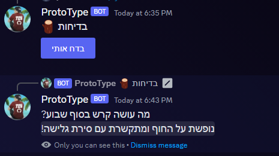
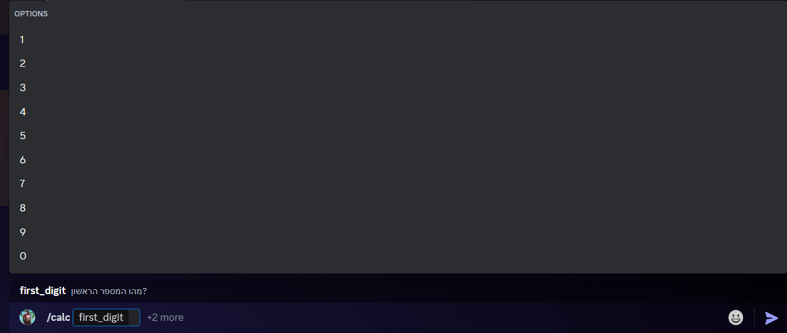
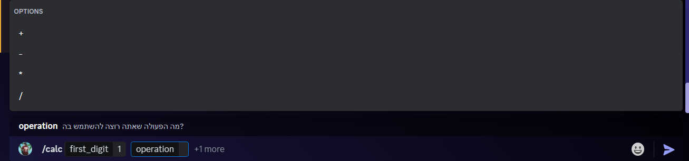
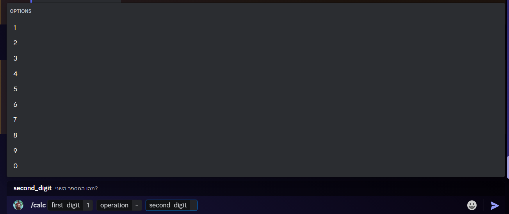
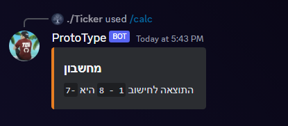
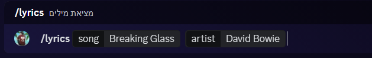
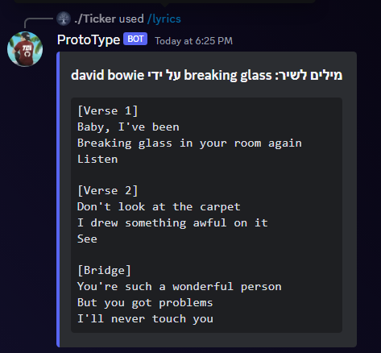

# מתכנת יקר
מצטער שלא יכולתי להגיע לשיחה, אנסה להגיע לשיחה הבאה!

פה אני יביא לך משימות לעשות אשר יראו לנו את הידע שלך, דרך עבודה שלך, וכולי.

יש לך כל זכות לדלג על שאלה לא מובנת, אך לידיעתך זה יפגע בציון הסופי.

אנא נסה לעשות את האתגרים הבאים בדרך הכי טובה שאפשר, **בהצלחה!**

## אתגר ראשון
צור כפתור שמשתמש יכול ללחוץ עליו על מנת לקבל בדיחה.

בדיחות:
[
מה עושה קרש בבית ספר?

כותב תזוזות!

איזה עץ תמצא בכל בית?

קרש!

איך קרש נוגעת לעניין?

היא יושבת בבר, מחכה להתנהג במגונן.

למה קרש עצובה?

היא רוצה להתקשר לאמא שלה, אבל נתקעה תחת המיטה!

מה עושה קרש בסוף שבוע?

נופשת על החוף ומתקשרת עם סירת גלישה!]

הבוט צריך לבחור ברנדומליות איזה בדיחה להציג.

### תוצאה סופית צריכה להראות משהו כזה:

## אתגר שני
צור פקודת סלאש ((/) command) למחשבון.

המטרה זה לתת למשתמש אפשרויות ללחיצה אשר יהפכו את החוויה של המשתמש לקלה יותר.

דוגמא מוצגת פה:

**שימו 🫀**
Choices הינם **חובה!**

### תוצאה סופית צריכה להראות משהו כזה:

## אתגר שלישי
צור פקודת סלאש ((/) command) שתביא מילים לשיר שהמתמש בוחר.

אתה הולך להשתמש ב [Genius API](https://docs.genius.com) על מנת למצוא מילים לשירים.

**בונוס נקודות** אם אתה יכול ליצור את הפקודה ללא שימוש בחבילה מסויימת. לא חובה בכלל.

דוגמא: 

### תוצאה סופית צריכה להראות משהו כזה:

# איך לשלוח קוד
יש לכם בריפו הזה שלושה קבצים, Challenge1.js, Challenge2.js, Challenge3.js

תעשו Fork לריפו ותשימו את הקוד שלכם בתוך כל קובץ.

תוודאו שהריפו שלכם **לפני בדיקה!!**

### בהצלחה!!
